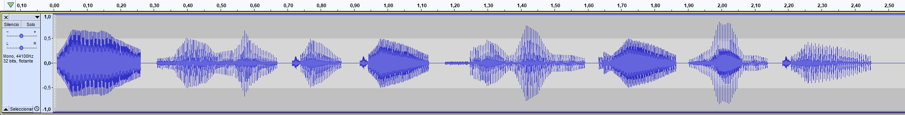

# HACK IT 2: BIT ROT

## 🚨 Work In Progess 🚨

<p align="center">
	
</p>

Este segundo nivel nos da la bienvenida con tres archivos denominados [Yellow](yellow), [Red](red), [Green](green) y una pista que lee
> *Se nos han perdido algunas cosas... ¿Donde estarán? ¿Quizá en estos ficheros?*

No mentiré diciendo que estuvimos bastante tiempo buscando posibles maneras de unir/entrelazar los ficheros de alguna manera debido a la relación que existe entre los colores amarillo, rojo y verde (tanto de forma aditiva en RGB, como de forma sustractiva en CMYK). Sin embargo, tenían tamaños muy distintos como para ser interoperables entre si, por lo que terminamos descartando la idea.
```
➜ ls -lh                                                                                  
total 81M                                                                                 
-rwxrwxrwx 1 ismael ismael  33M Jul 25 20:56 green
-rwxrwxrwx 1 ismael ismael  49M Jul 25 20:56 red
-rwxrwxrwx 1 ismael ismael 250K Jul 25 20:56 yellow
```

Tras ver que no hay forma alguna de trabajar con los tres ficheros simultaneamente, y que ninguno de ellos tiene extensión alguna, procedemos a analizarlos separadamente con un editor hexadecimal:

## yellow
Lo abrimos en el editor hexadecimal, y observamos que tenía varios huecos vacios tanto al principio como al final, además de alguno entre medias, pero no había ningún texto legible ni nada que nos hiciera pensar por donde podrían ir los tiros. Como estabamos perdidos empezamos a tratar a abrirlo con diferentes programas que suelen repetirse en estos tipos de hackits: Audacity, Wireshark...

Aun que en el primer intento de abrirlo con Audacity nos muestra un error, nos sugiere que podemos intentar abrirlo como dato en bruto:
> Audacity no reconoce el tipo de archivo 'yellow'. Intente instalar FFmpeg. Si es audio sin compresión, intente importarlo usando Archivo > Importar > Datos en bruto.

Probamos a hacerlo y, voilá, tenemos un audio!
<p align="center">
	
</p>

Sin embargo al reproducirlo se escucha acelerado el audio y no se distingue lo que dice, por lo que modificando la velocidad de reproducción en Audacity nos permitirá escuchar de forma clara que la primera clave es:
> r0tt3nb1t

*Esto tiene muy buena pinta si recordamos que la pista de este segundo hackit era "bit rot"*


## red
Tras pocos segundos de abrir este segundo fichero en el edito hexadecimal vemos dos trozos rodeados de bytes nulos que nos llaman mucho la atención. Por un lado un código SQL que indicaba la creación de varias tablas redX, cada una de ellas con dos strings de diez caracteres dentro:

```
..........................................9....
..Ktablered1000red1000.CREATE TABLE red1000(red
z blob)N......ytablered100red100.CREATE TABLE r
ed100(reda varchar(10),redb varchar(10))H......
utablered9red9.CREATE TABLE red9(reda varchar(1
0),redb varchar(10))H......utablered8red8.CREAT
E TABLE red8(reda varchar(10),redb varchar(10))
H......utablered7red7.CREATE TABLE red7(reda va
rchar(10),redb varchar(10))H......utablered6red
6.CREATE TABLE red6(reda varchar(10),redb varch
ar(10))H......utablered5red5.CREATE TABLE red5(
reda varchar(10),redb varchar(10))H......utable
red4red4.CREATE TABLE red4(reda varchar(10),red
b varchar(10))H......utablered3red3.CREATE TABL
E red3(reda varchar(10),redb varchar(10))H.....
.utablered2red2.CREATE TABLE red2(reda varchar(
10),redb varchar(10))H......utablered1red1.CREA
TE TABLE red1(reda varchar(10),redb varchar(10)
)..............................................
```


Y, por otro lado, una serie de números muy sospechosos que podrían ser ASCII:
```
...............................................
..................#..M.0000000 5473 6572 6d34 3
352 000a.......................................
```

Pasándolos por un convertidos hexadecimal a ASCII obtenemos la siguiente cadena con no demasiado sentido:
> Tserm43R

Sin embargo, como hemos obtenido una segunda cadena, dejamos este segundo fichero a un lado para ir a por el tercero y ver si todo acaba cogiendo sentido.

## green
Este último fichero es el único de los tres que parece ser un fichero normal, ya que no tiene ningún hueco de bytes nulos en su interior. Tras una rapida ojeada encontramos un _"trololo"_ al final del fichero, por lo que tiene que haber alguna trampa dentro de este fichero:
```
T...@..T...j..>.f...Kj......W.O.......Esg....:.
...~Rc.W2 ..;.S|.C...|s.X..+P..f}..+.X.H.....f.
.U~..1....pS'..9S{.........'C.xz.xi.r.-U.U....#
..Q..0..<)...R...8.H.t...Sp.s.JD^..Q...t).....a
M~.P....n.-]..trololo.KN5.sMQ.............E,...
......NC.a;./-.n.%.5...^.
```

Por lo tanto, decidimos analizarlo con una herramienta forensica como puede ser `binwalk`, y... sorpresa! Binwalk nos indica que el fichero green tiene un _gzip_ incrustado dentro:
```
➜ binwalk green

DECIMAL       HEXADECIMAL     DESCRIPTION                                 
--------------------------------------------------------------------------------
27337196      0x1A121EC       HPACK archive data
33554432      0x2000000       gzip compressed data, has original file name: "trololo", from Unix, last modified: 2019-07-15 23:29:50 
```

Para extraer dicho archivo comprimido basta con indicar al comando _binwalk_ la opción -e, y nos extraerá todos los archivos encapsulados a una carpeta. Después, abrimos el archivo trololo recien extraido lo cual nos da el último tercio de la clave:
> ce1VEd!


## Juntando el puzle
Tras analizar los tres ficheros y obtener de cada uno una cadena, tenemos lo siguiente:
- `r0tt3nb1t`
- `Tserm43R`
- `ce1VEd!`

Hmm... ¿_"rotten bit received"_? Esto tendría sentido, pero esa segunda cadena no encaja muy bien con el resto...

Tras un rato volviendo a analizar el segundo fichero, caemos en el hecho de que podría tratarse de un anagrama:
> Tserm43R --> sTr34mRe

Juntando todo obtenemos la clave final `r0tt3nb1tsTr34mRece1VEd!`. Sin embargo la página no nos la da como correcta, por lo que se nos ha debido de pasar algun detalle. Tras unos minutos nos damos cuenta que las dos últimas claves tienen dos letras mayusculas, mientras que la primera no tiene ninguna (debido a que lo hemos sacado del audio), por lo que tan solo hay que hacer un poco de fuerza bruta con las combinaciones que pueden salir para llegar a la clave final correcta: 
> R0tt3nB1tsTr34mRece1VEd!

*PD: tras la reunión post-hackit, explicaron que si escuchamos con atención el audio podremos distinguir como las mayusculas tienen un mayor pitch que el resto.*