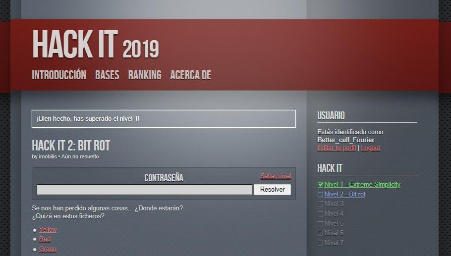

# HACK IT 2: BIT ROT

## 🚨 Work In Progess 🚨

<p align="center">
	
</p

Este segundo nivel nos da la bienvenida con tres archivos denominados [Yellow](yellow), [Red](red), [Green](green) y con una pista que da a entender que hay algo a recuperar en los mismos.

Los tres están sin formato alguno, por lo que nuestro primer paso es saltar de seguido a un editor hexadecimal que nos permita ver las entrañas de los ficheros. No mentiré diciendo que nos costó varias horas darnos cuenta que al final de red aparecía un _trololo_. 

También cabe decir que estuvimos mucho tiempo buscando posibles maneras de unir/entrelazar los ficheros de alguna manera debido a la relación que existe entre los colores amarillo, rojo y verde (tanto de forma aditiva en RGB, como de forma sustractiva en CMYK). Sin embargo, pesaban 250K, 49M y 33M correspondientemente, por lo tanto no podía ser una simple combinación de los tres. También probamos a realizar ciertas operaciones lógicas a nivel de bits y bytes

<p align="center">
	
</p>

```
➜ ls -lh                                                                                  
total 81M                                                                                 
-rwxrwxrwx 1 ismael ismael  33M Jul 25 20:56 green
-rwxrwxrwx 1 ismael ismael  49M Jul 25 20:56 red
-rwxrwxrwx 1 ismael ismael 250K Jul 25 20:56 yellow
```


```
T...@..T...j..>.f...Kj......W.O.......Esg....:.
...~Rc.W2 ..;.S|.C...|s.X..+P..f}..+.X.H.....f.
.U~..1....pS'..9S{.........'C.xz.xi.r.-U.U....#
..Q..0..<)...R...8.H.t...Sp.s.JD^..Q...t).....a
M~.P....n.-]..trololo.KN5.sMQ.............E,...
......NC.a;./-.n.%.5...^.
```

La solución de este primer archivo reside en realizar un analisis del mismo con alguna herramienta forensica de archivos, en nuetro caso, nos decantamos por `binwalk`. 

```
➜ binwalk green

DECIMAL       HEXADECIMAL     DESCRIPTION                                 
--------------------------------------------------------------------------------
27337196      0x1A121EC       HPACK archive data
33554432      0x2000000       gzip compressed data, has original file name: "trololo", from Unix, last modified: 2019-07-15 23:29:50 
```

Podemos ver que hay un archivo _gzip_ encapsulado dentro del propio archivo green. Para extraerlo basta con indicar al comando _binwalk_ la opción -e, y nos extraerá todos los archivos encapsulados a una carpeta. Abriendo el archivo trololo recien extraido nos dará el primer tercio de la clave `ce1VEd!`